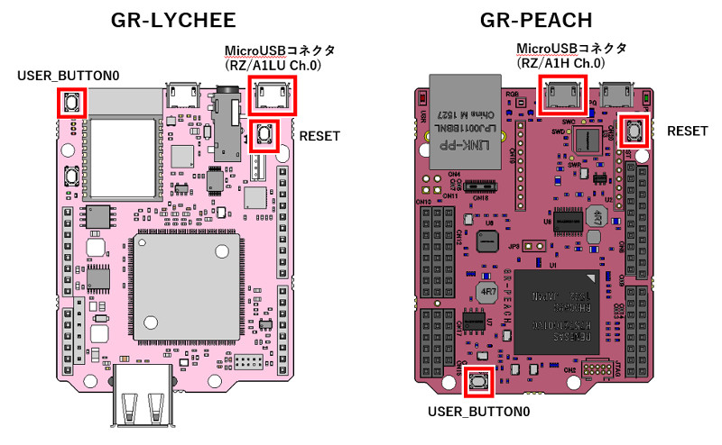
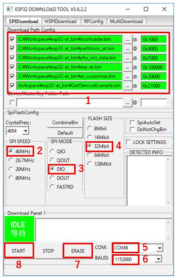

# GR-Boards_ESP32_Serial_Bridge
ESP32(UART)とPC(USB)をブリッジするサンプルプログラムです。  
ESP32の評価やFlash書き込みの際にご利用いただけます。  
GR-LYCHEEはボード上にESP32が搭載されています。  
GR-PEACHは``GR-WIRELESS CAMERA Shield``を接続することでESP32を追加することができます。  

## 使い方
コンパイル済みの``GR-Boards_ESP32_Serial_Bridgeバイナリファイル[GR-PEACH_ESP32_Serial_Bridge_for.bin, GR-LYCHEE_ESP32_Serial_Bridge.bin]``と``ESP32をATコマンド用のファームウェア「esp32-at」``が`docs\esp32-at_bin.zip`内に格納されています。  
サンプルコードをそのまま使用する場合はプロジェクト内`docs\esp32-at_bin.zip`を展開し、お使いのボードに合わせて``GR-Boards_ESP32_Serial_Bridgeバイナリファイル``をボードに書き込んで使用してください。  

### シリアル設定
``MicroUSBコネクタ(RZ/A1 Ch.0)``をPCと接続して使用します。  

  

Windows10以外ご使用の場合、ドライバのインストールが必要となります。下記サイトのからドライバーをダウンロードできます。  

https://os.mbed.com/docs/latest/tutorials/windows-serial-driver.html

但し、「署名なしドライバ」となっていますので、お使いのWindowsバージョンによってはそのままインストールすることはできません。お使いのPC毎に設定方法が異なるため、検索サイトで「署名なしドライバ」で検索してください。  

ターミナルソフトソフトで通信を確かめる場合は、下記設定で通信してください。  

|            |        |
|:-----------|:-------|
| ボーレート | 115200 |
| データ     | 8bit   |
| パリティ   | none   |
| ストップ   | 1bit   |
| フロー制御 | none   |

### ボタン
`USER_BUTTON0`を押すとESP32にリセットが入ります。  

### ESP32をFlash書き込みモードにする
ESP32を書き込みモードにする際は、`USER_BUTTON0`を押しながら`RESET`を押してください。書き込みモードになるとボード上のLED1が光ります。書き込みモードを解除する場合はもう一度`RESET`を押してください。  

### Flash Download Toolsの使い方
``ESP32をATコマンド用のファームウェア「esp32-at」``の書き込みを例に、Windows PC版 Flash Download Tools V3.6.2.2の使い方を紹介します。下記より``Flash Download Tools (ESP8266 & ESP32)``をダウンロードしてください。  

Espressif’s official Flash Download Tools:  
http://espressif.com/en/support/download/other-tools?keys=&field_type_tid%5B%5D=13

`flash_download_tools_v3.6.2.2.zip`を展開し、`ESPFlashDownloadTool_v3.6.2.2.exe`を実行します。  

  
*ESP32 DownloadTool* を選択します。  

  

1. 書き込み用の.binファイルを設定します。  
  ``ESP32をATコマンド用のファームウェア「esp32-at」``に書き換える場合は`docs\esp32-at_bin.zip`内の書き込み用の.binファイルを下記のように設定してください。  
  bootloader.bin(0x1000)、partitions_at.bin(0x8000)、phy_init_data.bin(0xF000)、esp-at.bin(0x100000)、at_customize.bin(0x20000)、GattServiceExample.bin(0x21000)。  
  左のチェックボックスにも忘れずにチェックを入れてください。  
2. SPI SPEEDに*40MHz*を設定します。  
3. SPI MODEに*DIO*を設定します。  
4. FLASH SIZEに*32Mbit*を設定します。  
5. COMに``MicroUSBコネクタ(RZ/A1 Ch.0)``に割り当たったCOMポートを設定します。  
6. ボーレートを選択します。``921600bps``での書き込みを確認できていますが、書き込みに失敗するようでしたらボーレートを下げてください。
7. ESP32を書き込みモードにします(上記"ESP32をFlash書き込みモードにする"を参照)。ターミナルソフトソフトで``MicroUSBコネクタ(RZ/A1 Ch.0)``に該当するCOMポートを開いている場合は、ターミナルソフトを終了させ、COMポートを開放してください。ツールのERASEボタンを押すと不要なデータの消去を開始します。上記図の緑色で「IDLE」と表示されている部分が「FINISH」になるまで待ってください。  
8. `USER_BUTTON0`を押して、ESP32をリセットします。その後、ツールのSTARTボタンを押すと書き込みを開始します。上記図の緑色で「IDLE」と表示されている部分が「FINISH」になるまで待ってください。  
